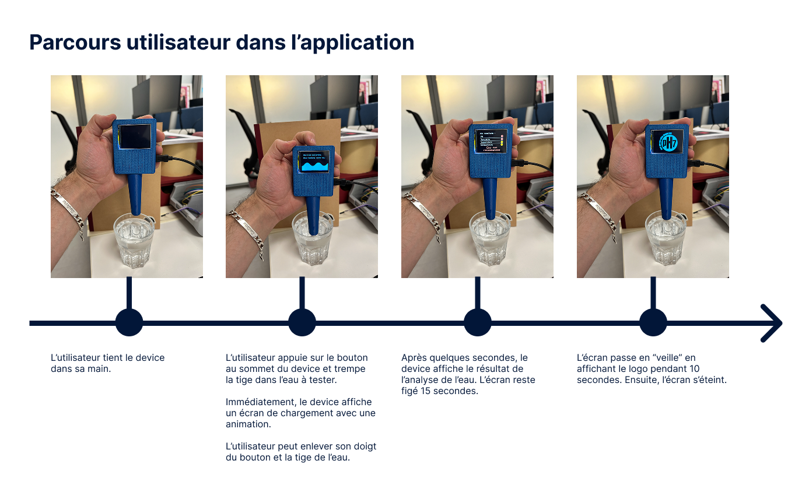
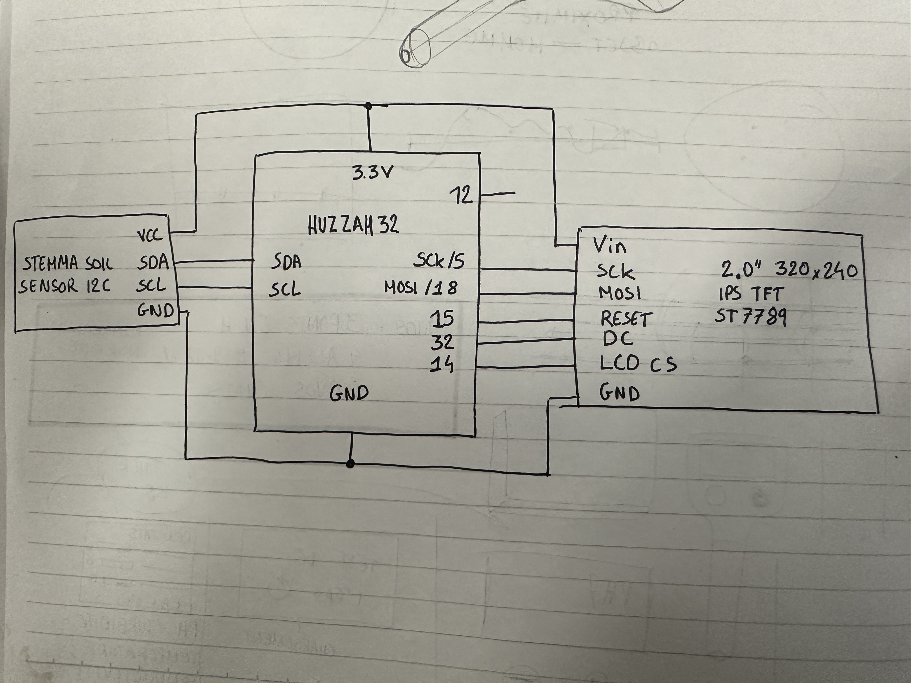
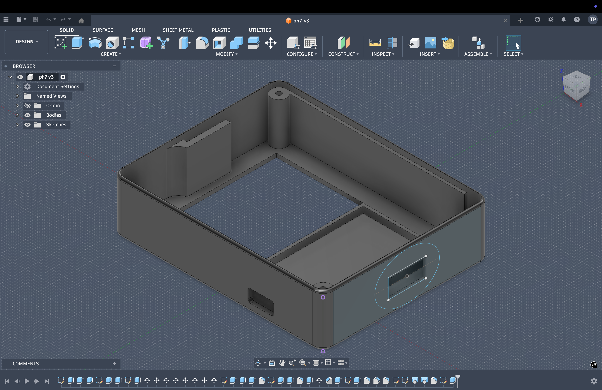

# Documentation du projet PH7

 - [Notice](#notice)
 - [Bill of materials](#bom)
 - [Vue schématique](#vue-schématique)
 - [Vues de la modélisation 3D](#vues-de-la-modélisation-3d)


## Notice
Github est une plateforme de documentation et de partage de projets numériques. Vous trouverez tous les éléments pour re-créer le device PH7. Toutes les images présentes sur cette page sont accessibles dans le dossier images. Le code du device est également accessible au dessus. 

## Parcours utilisateur

Cette section explique les étapes d'utilisation du device. Assurez-vous que le device est bien branché. Vous pouvez utiliser un chargeur de téléphone en 5V pour alimenter le device.



La première fois, l'écran affiche "eau potable", puis "eau non recommandee" et ainsi de suite. L'écran passe en "veille" au bout de 10 secondes. Il suffit de relancer une détection pour le réveiller. 

## BOM 
Électronique utilisée pour ce projet :
- [Huzzah32↗]()
- [Écran ST7789↗]()
- [Soil sensor↗]()

## Vue schématique



## Vues de la modélisation 3D

Modélisation 3D de l'objet réalisée avec le logiciel Fusion360 de la suite Autodesk. Les fichiers .stl pour modifier ou ré-imprimer le prototype sont accessibles dans le dossier ```modeles_3D```.




## Assemblage

Une photo de l'encombrement à l'intérieur du device. 

